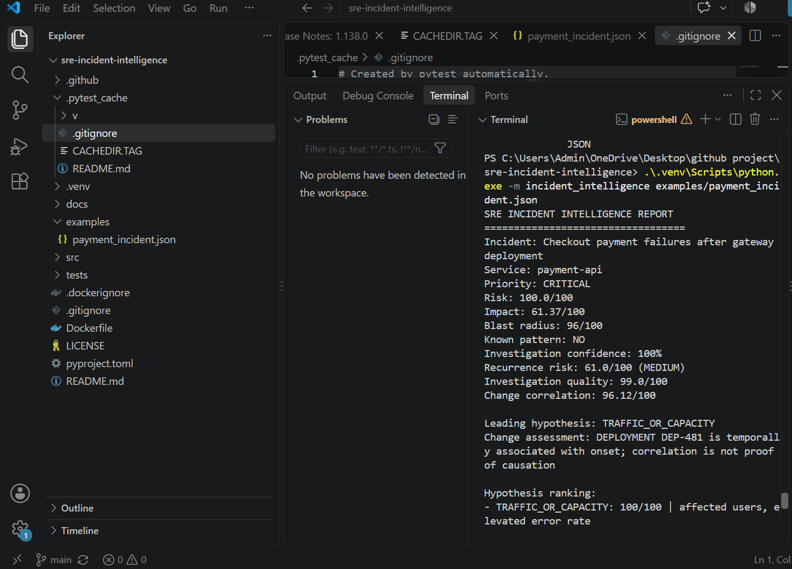
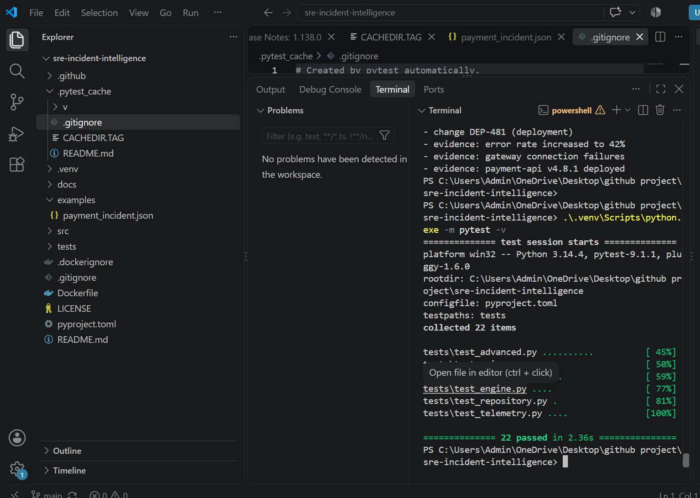
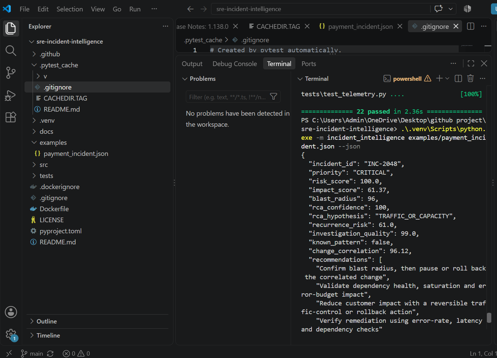
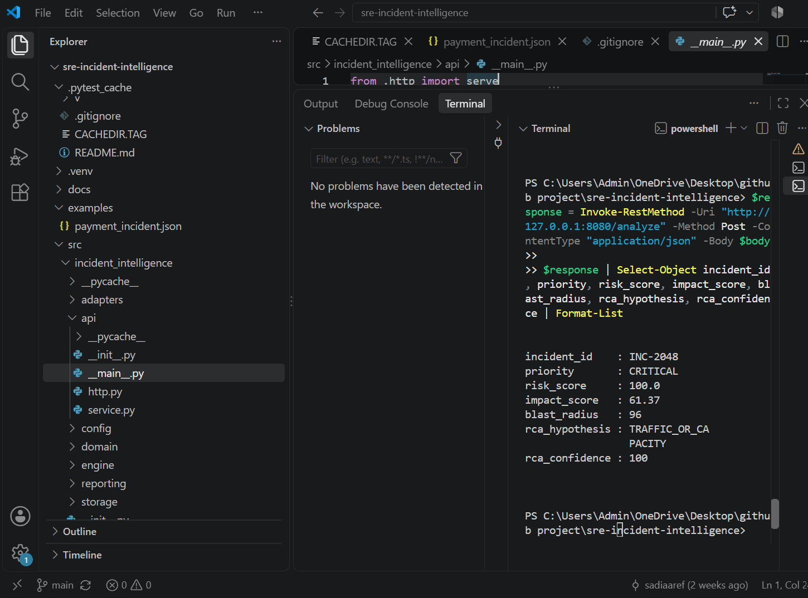
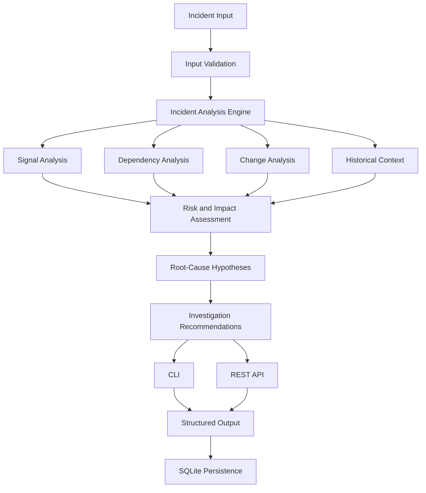

# SRE Incident Intelligence

<p align="center">
  <strong>Making production incident investigation more structured, explainable, and actionable.</strong>
</p>

<p align="center">
  A Python-based reliability engineering project that analyzes incident signals, service dependencies, and deployment changes to help engineers understand failures and investigate their potential causes.
</p>

<p align="center">
  
  
  
  
  
</p>

---

## Overview

When a production system fails, identifying the cause is rarely as simple as looking at a single error message. Engineers may need to investigate unusual signals, recent deployments, service dependencies, and historical incidents before they can understand what went wrong.

**SRE Incident Intelligence explores how software can make that investigation more organized.**

The application processes incident information and produces structured analysis, including risk and impact assessments, potential blast radius, root-cause hypotheses, and recommendations for further investigation.

I built this project to strengthen my understanding of backend engineering and reliability concepts while exploring a practical problem that software engineering teams encounter.

> **Project philosophy:** Help engineers make better-informed investigation decisions by turning scattered incident information into structured, explainable results.

## Project Demo

The screenshots below show the application in action, from incident analysis to test execution and API output.

### 1. Incident Analysis



*An example of the incident analysis output, including priority, impact, and investigation findings.*

### 2. Test Results



*Automated tests used to verify important application behavior.*

### 3. Structured JSON Output



*Machine-readable analysis results that can be consumed by other applications.*

### 4. REST API Response



*An example of interacting with the analysis engine through the API.*

---

## Key Capabilities

| Capability | What it does |
|---|---|
| Incident analysis | Processes incident information through a structured workflow |
| Risk assessment | Calculates incident priority and risk indicators |
| Impact assessment | Evaluates the potential severity of an incident |
| Dependency analysis | Examines relationships between services |
| Blast-radius estimation | Identifies services that may be affected by an incident |
| Root-cause hypotheses | Produces possible explanations based on available evidence |
| Confidence estimates | Communicates uncertainty in the generated hypotheses |
| Historical comparison | Uses available incident history as investigation context |
| Recommendations | Suggests follow-up investigation and recovery actions |
| CLI | Supports command-line analysis |
| REST API | Exposes analysis functionality programmatically |
| SQLite persistence | Stores application data |
| Automated testing | Checks core behavior and API functionality |
| Docker and CI | Supports consistent environments and automated checks |

## How It Works

The application follows a structured workflow:

1. **Receive incident data** — Read incident details, service information, and available signals.
2. **Validate input** — Check the incoming data before analysis.
3. **Analyze signals** — Examine evidence for unusual patterns.
4. **Evaluate dependencies** — Consider relationships between services to estimate potential impact.
5. **Review changes and history** — Use deployment information and available historical context.
6. **Assess risk and impact** — Generate structured indicators to help prioritize investigation.
7. **Generate hypotheses** — Present possible root causes with confidence estimates.
8. **Provide recommendations** — Suggest practical next steps for engineers.

### System Architecture



The architecture separates analysis responsibilities from the interfaces used to access them. This makes the system easier to test, understand, and extend.

---

## Engineering Decisions

Beyond implementing features, I focused on a few engineering principles while building this project.

### Modular design

Organizing functionality into separate packages helps keep responsibilities clear and makes individual components easier to test and maintain.

### Structured outputs

JSON output makes analysis results easier to inspect and provides a foundation for integration with other tools.

### API accessibility

The REST API allows other applications to interact with the analysis engine without depending on the command-line interface.

### Testability

Automated tests help verify expected behavior and reduce the risk of unintended changes during development.

### Reliability-oriented thinking

Concepts such as service dependencies, blast radius, incident history, and root-cause hypotheses encourage a broader view of system failures rather than focusing only on isolated errors.

---

## Technology Stack

| Category | Technologies |
|---|---|
| Programming language | Python |
| API | REST |
| Database | SQLite |
| Testing | Pytest |
| Containerization | Docker |
| Continuous integration | GitHub Actions |
| Version control | Git and GitHub |

---

## Getting Started

You can run the project locally using Python.

### Prerequisites

- Python 3.10 or later
- Git
- pip

### 1. Clone the repository

```bash
git clone https://github.com/sadiaaref/sre-incident-intelligence.git
cd sre-incident-intelligence
```

### 2. Create a virtual environment

**Windows (PowerShell):**

```powershell
python -m venv .venv
.\.venv\Scripts\Activate.ps1
```

**macOS / Linux:**

```bash
python3 -m venv .venv
source .venv/bin/activate
```

### 3. Install the project

```bash
python -m pip install -e .
```

### 4. Run an example incident

```bash
python -m incident_intelligence examples/payment_incident.json
```

### 5. Run the test suite

```bash
python -m pytest -v
```

---

## Using the Command-Line Interface

The CLI provides a direct way to analyze an incident.

### Standard output

```bash
python -m incident_intelligence examples/payment_incident.json
```

### JSON output

```bash
python -m incident_intelligence examples/payment_incident.json --json
```

The JSON mode is useful when analysis results need to be inspected programmatically or passed to another tool.

---

## REST API

The application also exposes its analysis functionality through a local REST API.

### Start the server

```bash
python -m incident_intelligence.api
```

The server runs at:

```text
http://127.0.0.1:8080
```

### Available endpoints

| Method | Endpoint | Purpose |
|---|---|---|
| GET | `/health` | Check whether the API is running |
| POST | `/analyze` | Submit incident data for analysis |

### Example request using PowerShell

```powershell
$body = Get-Content -Raw "examples/payment_incident.json"

$response = Invoke-RestMethod `
  -Uri "http://127.0.0.1:8080/analyze" `
  -Method Post `
  -ContentType "application/json" `
  -Body $body

$response
```

This makes it possible to interact with the analysis engine through an HTTP request rather than running the CLI directly.

---

## Testing and Quality Checks

Testing is an important part of the project because incident analysis should produce predictable behavior for known inputs.

Run the complete test suite:

```bash
python -m pytest -v
```

The test suite includes coverage for areas such as:

- Core analysis behavior
- API functionality
- Application components
- Repository operations
- Telemetry-related functionality
- Additional analysis scenarios

---

## Project Structure

```text
sre-incident-intelligence/
│
├── .github/
│   └── workflows/
│
├── docs/
│
├── examples/
│   └── payment_incident.json
│
├── screenshots/
│   ├── incident-analysis.png
│   ├── test-results.png
│   ├── json-output.png
│   └── api-response.png
│
├── src/
│   ├── incident_intelligence/
│   │   ├── adapters/
│   │   ├── api/
│   │   ├── config/
│   │   ├── domain/
│   │   ├── engine/
│   │   ├── reporting/
│   │   ├── storage/
│   │   ├── __init__.py
│   │   ├── __main__.py
│   │   └── cli.py
│   │
│   └── sre_incident_intelligence.egg-info/
│
├── tests/
│   ├── test_advanced.py
│   ├── test_api.py
│   ├── test_components.py
│   ├── test_engine.py
│   ├── test_repository.py
│   └── test_telemetry.py
│
├── .dockerignore
├── .gitignore
├── Dockerfile
├── LICENSE
├── pyproject.toml
└── README.md
```

*The `.venv/` and `.pytest_cache/` directories are local development artifacts and are intentionally excluded from this overview. The `.egg-info/` directory contains generated package metadata.*

---

## Current Limitations

This project is an engineering prototype intended to support investigation and learning. Its risk assessments and root-cause hypotheses are not a replacement for production observability systems or engineering judgment.

The quality of its analysis depends on the completeness and accuracy of the supplied incident information.

## Future Improvements

There are several directions in which I would like to take this project:

- Integrate with real monitoring and observability platforms.
- Explore more advanced anomaly-detection techniques.
- Improve historical incident comparison.
- Add richer service dependency visualizations.
- Expand API and integration test coverage.
- Evaluate performance with larger incident datasets.
- Explore ways to make generated hypotheses more transparent and easier to validate.

---

## What I Learned

Building SRE Incident Intelligence helped me connect concepts that are often studied separately: backend development, data persistence, testing, API design, and reliability engineering.

More importantly, it encouraged me to think beyond whether a program works and consider how it can be maintained, tested, understood, and extended by other engineers.

This project represents my continued effort to build practical software, learn through implementation, and develop an engineering mindset.

---

## Author

**Sadia Aref**

- GitHub: [@sadiaaref](https://github.com/sadiaaref)
- Project repository: [SRE Incident Intelligence](https://github.com/sadiaaref/sre-incident-intelligence)
