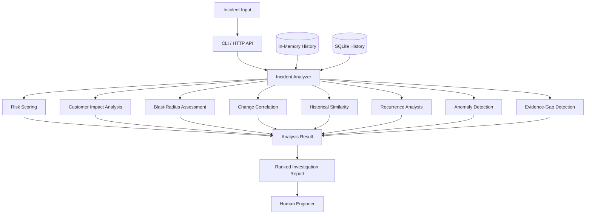
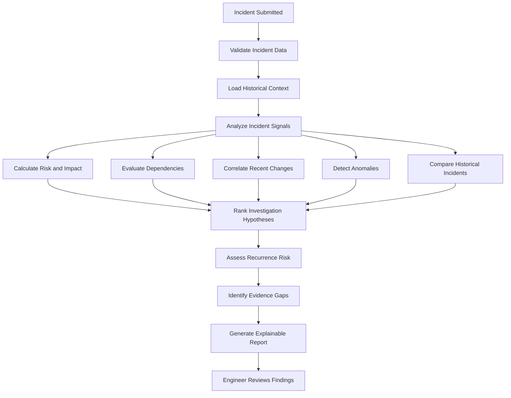
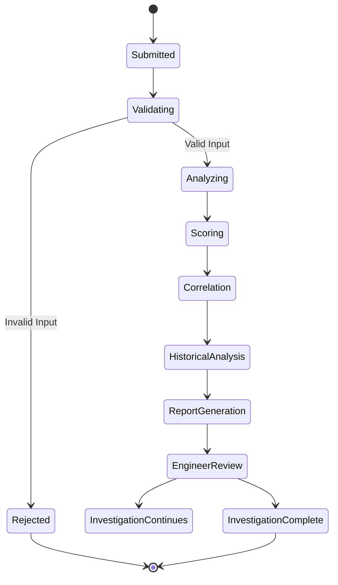

# SRE Incident Intelligence Engine

**An explainable incident triage and investigation-assistance engine built with Python and SQLite.**

SRE Incident Intelligence transforms structured incident signals into a ranked, auditable investigation view for engineers.

It helps identify potential causes, assess operational risk, evaluate customer impact, and prioritize investigations without automatically modifying production systems.

The project explores how software reliability engineering can benefit from deterministic analysis, historical incident comparison, explainable scoring, and structured investigation workflows.

---

## Why I Built This

When a production incident occurs, engineers must investigate multiple signals to understand what happened and determine where to focus their attention.

The challenge is not simply detecting an issue. It is making investigation more structured, explainable, and efficient.

SRE Incident Intelligence focuses on questions such as:

- How severe is an incident?
- Which services or dependencies may be affected?
- Could a recent deployment be related to the incident?
- Which investigation hypotheses deserve attention first?
- Have similar incidents occurred in the past?
- Is the incident likely to recur?
- What evidence is missing from the investigation?
- How can engineers make informed decisions without relying on black-box recommendations?

The engine processes structured incident data and produces an explainable investigation report that keeps human engineers in control of diagnosis and remediation.

---

## Architecture



The core engine is deterministic and intentionally explainable.

It consumes already-structured incident signals rather than pretending to ingest raw logs, traces, or a production observability platform.

---

## Main Investigation Flow



### Main Flow Explained

1. An incident is submitted through the CLI or HTTP API.
2. The input is validated before analysis.
3. Historical incident context is retrieved when available.
4. The engine evaluates risk, customer impact, dependencies, and operational signals.
5. Recent changes and historical incidents are examined for potential correlations.
6. Investigation hypotheses are ranked using deterministic rules.
7. Recurrence risk and evidence gaps are assessed.
8. An explainable report is generated for an engineer to review.

---

## Core Features

### 1. Multi-Factor Risk Scoring

Evaluates incidents using multiple operational signals rather than relying on a single severity indicator.

The analysis considers risk, customer impact, and potential blast radius to provide a more structured view of incident severity.

### 2. Customer-Impact Assessment

Helps evaluate the potential effect of an incident on customers.

The resulting assessment provides additional context for prioritizing investigation efforts.

### 3. Blast-Radius Analysis

Evaluates potential impact across affected services and dependencies.

This helps engineers understand the possible scope of an incident before deciding where to investigate.

### 4. Explainable Hypothesis Ranking

Generates ranked investigation hypotheses across several signal categories:

- Dependency failures
- Recent deployments and changes
- Traffic and capacity anomalies

Each hypothesis is intended to provide an understandable reason for further investigation rather than presenting an unexplained conclusion.

### 5. Deployment and Change Correlation

Examines recent deployment or configuration changes that may be related to an incident.

The system explicitly distinguishes correlation from causation. A recent change may be relevant evidence, but it is not automatically considered the root cause.

### 6. Historical Incident Similarity

Compares current incidents with historical records using normalized token fingerprints.

This helps identify potentially related incidents and provides additional investigative context.

### 7. Recurrence-Risk Analysis

Evaluates historical patterns and incident characteristics to help identify possible recurrence concerns.

The resulting assessment supports preventive investigation rather than guaranteeing future outcomes.

### 8. Evidence-Gap Detection

Identifies missing information that may limit the quality of an investigation.

The engine provides recommendations for gathering additional evidence and improving the investigation process.

### 9. Lightweight Anomaly Detection

Analyzes time-series metric samples to identify unusual behavior.

This provides an additional signal for investigation when operational measurements deviate from expected patterns.

### 10. Persistent Incident History

Supports both in-memory and durable SQLite history adapters.

Persistent storage allows historical incident context to remain available across application restarts.

### 11. HTTP API

Provides a lightweight HTTP interface with:

- `GET /health` — API health check
- `POST /analyze` — Incident analysis

The API includes payload validation and request-size limits.

### 12. CLI Interface

Supports human-readable and JSON output for incident analysis.

This makes the engine useful for both interactive investigation and programmatic integration.

---

## Investigation Lifecycle



The lifecycle separates automated analysis from human investigation.

The engine provides evidence and ranked hypotheses, while engineers remain responsible for determining root cause and selecting remediation actions.

---

## Project Structure

```text
sre-incident-intelligence/
│
├── src/
│   └── incident_intelligence/
│
├── examples/
│   └── payment_incident.json
│
├── tests/
│
├── .github/
│   └── workflows/
│
├── Dockerfile
├── requirements.txt
├── README.md
└── ...
```

The implementation is organized around incident analysis, scoring, historical context, persistence, external interfaces, and testing.

---

## Quick Start

### 1. Clone the repository

```bash
git clone https://github.com/sadiaaref/sre-incident-intelligence.git
cd sre-incident-intelligence
```

### 2. Run the test suite

```bash
python -m pytest -v
```

### 3. Analyze an example incident

```bash
python -m src.incident_intelligence examples/payment_incident.json
```

### 4. Generate JSON output

```bash
python -m src.incident_intelligence examples/payment_incident.json --json
```

### 5. Run the API

```bash
python -m incident_intelligence.api
```

The API provides the following endpoints:

| Method | Endpoint | Purpose |
|---|---|---|
| GET | `/health` | Check API availability |
| POST | `/analyze` | Analyze a submitted incident |

Refer to the example incident JSON for the expected request structure.

---

## Testing

The project includes automated tests covering core analysis and API behavior.

Testing areas include:

- Incident input validation
- Risk and impact scoring
- Hypothesis ranking
- Historical similarity
- Recurrence-risk analysis
- Evidence-gap detection
- Anomaly detection
- SQLite persistence
- HTTP integration behavior
- Error handling

Run the test suite using:

```bash
python -m pytest -v
```

---

## Tech Stack

| Technology | Purpose |
|---|---|
| Python | Core analysis and application logic |
| SQLite | Persistent incident history |
| HTTP API | Incident submission and analysis |
| Pytest | Unit and integration testing |
| Docker | Containerized execution |
| GitHub Actions | Continuous integration |
| JSON | Structured incident input and output |

---

## Engineering Concepts Demonstrated

Building SRE Incident Intelligence provided practical experience with:

- Backend architecture
- Ports-and-adapters design
- Dependency injection
- Immutable result models
- Deterministic scoring
- Explainable decision support
- Persistence abstraction
- Historical data analysis
- HTTP API design
- Input validation
- Automated testing
- Continuous integration
- Human-in-the-loop system design

---

## Design Principles

### Explainability Over Black-Box Decisions

Every investigation result should be understandable and traceable to the signals used during analysis.

### Human-in-the-Loop Investigation

The engine assists engineers rather than replacing their judgment.

### Correlation Is Not Causation

A relationship between a deployment and an incident is treated as investigative evidence, not automatic proof of root cause.

### Reproducible Analysis

Deterministic analysis helps produce consistent results for the same inputs and historical context.

### Clear Separation of Responsibilities

The core analysis engine remains separate from CLI, HTTP, and persistence adapters.

---

## Limitations

- The engine consumes structured incident signals rather than raw production telemetry.
- It does not automatically remediate incidents.
- Investigation hypotheses are decision-support suggestions, not guaranteed root causes.
- Historical similarity depends on the quality and availability of stored incident data.
- Recurrence-risk assessments are indicators, not guarantees of future behavior.

---

## Future Improvements

Potential areas for further development include:

- Integration with real observability platforms
- Live metrics and tracing ingestion
- Advanced incident correlation
- Enhanced investigation dashboards
- Additional persistence backends
- More detailed operational monitoring
- Improved incident visualization
- Expanded historical analysis capabilities

---

## Author

**Sadia Aref**

Python Developer | Backend & Software Engineering

[GitHub Profile](https://github.com/sadiaaref)
